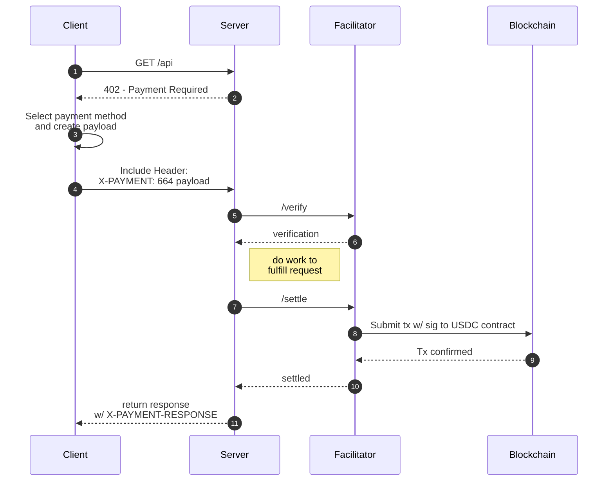

```mermaid
sequenceDiagram
    autonumber
    participant C as Client
    participant S as Server
    participant F as Facilitator
    participant B as Blockchain

    C->>S: GET /api
    S-->>C: 402 - Payment Required

    C->>C: Select payment method<br/>and create payload
    C->>S: Include Header:<br/>X-PAYMENT: 664 payload

    S->>F: /verify
    F-->>S: verification

    Note right of S: do work to<br/>fulfill request

    S->>F: /settle
    F->>B: Submit tx w/ sig to USDC contract
    B-->>F: Tx confirmed
    F-->>S: settled
    S-->>C: return response<br/>w/ X-PAYMENT-RESPONSE
```